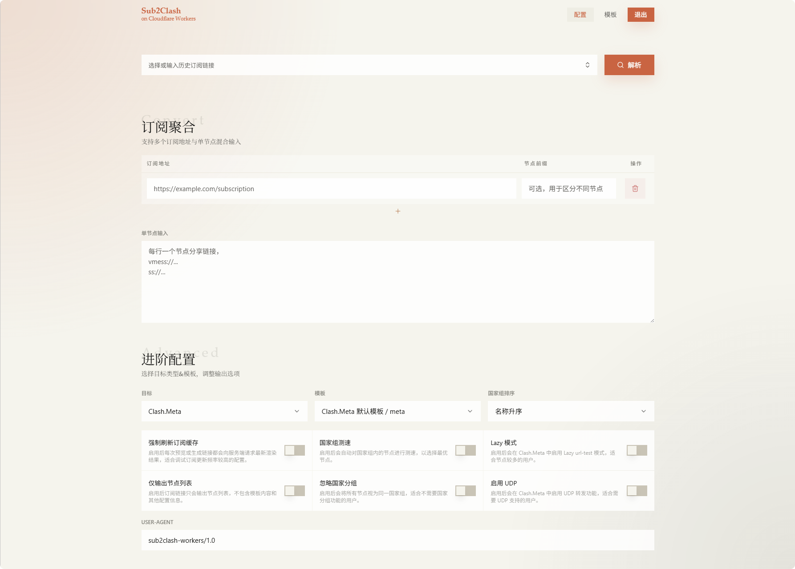

<div align="center">
<h1>Sub2Clash on Workers</h1>

一个基于 Cloudflare Workers 的私有订阅聚合与转换工具，支持将多个订阅和单节点聚合统一收口成一份可复用的 Clash / Clash.Meta 配置

</div>
<div align="right">
本项目基于 <a href="https://github.com/bestnite/sub2clash" target="_blank">bestnite/sub2clash</a>，90% 由 AI 重新开发
</div>

## 界面预览



## 核心功能

- 把多个订阅、零散节点和自定义规则收口到一个统一入口
- 需要一个工具维护模板、规则和短链接，而不是手写 YAML
- 无需服务器，部署简单无需维护

## 协议支持

输入侧当前支持以下分享协议：

- Clash：`ss`、`ssr`、`vmess`、`trojan`、`socks5`
- Clash.Meta：`ss`、`ssr`、`vmess`、`vless`、`trojan`、`hysteria`、`hysteria2`、`socks5`、`anytls`

远程订阅内容支持两类格式：

- 已经是 Clash YAML，且顶层包含 `proxies`
- Base64 或纯文本的节点分享链接列表

## 部署

### 一键部署：

[](https://deploy.workers.cloudflare.com/?url=https://github.com/Tokinx/sub2clash-workers)

### 手动部署：

```bash
# 创建 KV Namespace
创建一个用于 CACHE 绑定的 KV Namespace
并把 ID 填入 wrangler.jsonc

# 设置生产 Secret
wrangler secret put APP_PASSWORD
wrangler secret put SESSION_SECRET

# 发布 Worker
bun run deploy
```

## 技术栈

- Runtime：Bun
- Backend：JavaScript、Cloudflare Workers、Hono
- Frontend：React 19、React Router 7、Tailwind CSS v4、shadcn/ui
- Test：Vitest、Testing Library、Cloudflare Workers Vitest Pool

## 快速开始

### 前置条件

- Bun
- Cloudflare 账号
- 一个 KV Namespace

### 安装依赖

```bash
bun install
```

### 本地开发

1. 准备本地密钥文件 `.dev.vars`

```dotenv
APP_PASSWORD=your-local-password
SESSION_SECRET=replace-with-a-random-secret
SESSION_TTL_SECONDS=2592000
SUB_CACHE_TTL_SECONDS=300
MAX_REMOTE_FILE_SIZE=1048576
```

2. 启动统一开发入口

```bash
bun run dev
```

默认会在 `http://127.0.0.1:8787` 启动，由 Vite 提供前端 HMR，并通过 `@cloudflare/vite-plugin` 挂接 Worker 运行时。

## 环境变量与 Secret

| 变量名                  | 必需 | 说明                     | 默认值       |
| ----------------------- | ---- | ------------------------ | ------------ |
| `APP_PASSWORD`          | ✓    | 管理台登录密码           | -            |
| `SESSION_SECRET`        | ✓    | 会话签名密钥             | -            |
| `SESSION_TTL_SECONDS`   | -    | Cookie 会话有效期        | 2592000 秒   |
| `SUB_CACHE_TTL_SECONDS` | -    | 远程订阅缓存 TTL         | 300 秒       |
| `MAX_REMOTE_FILE_SIZE`  | -    | 单次远程订阅拉取大小上限 | 1048576 字节 |

## 相关文档

- [DESIGN.md](/root/Workspace/sub2clash-workers/DESIGN.md)
- [.docs/architecture.md](/root/Workspace/sub2clash-workers/.docs/architecture.md)
- [.docs/api.md](/root/Workspace/sub2clash-workers/.docs/api.md)
- [.docs/regression.md](/root/Workspace/sub2clash-workers/.docs/regression.md)
- [.tasks/roadmap.md](/root/Workspace/sub2clash-workers/.tasks/roadmap.md)

## 鸣谢

本项目基于 <a href="https://github.com/bestnite/sub2clash" target="_blank">bestnite/sub2clash</a>，90% 由 AI 重新开发
